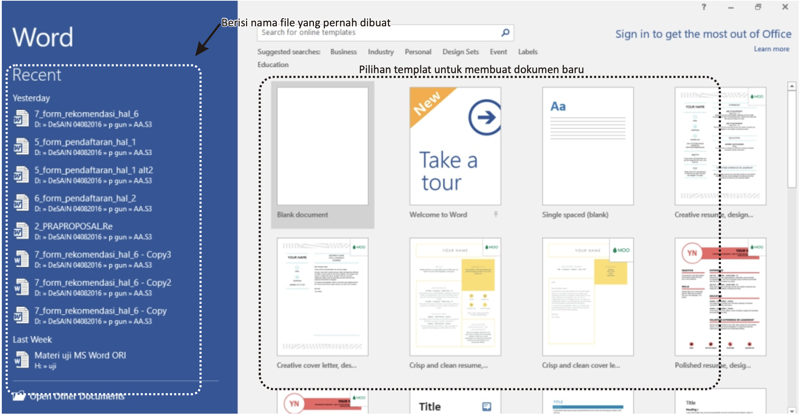
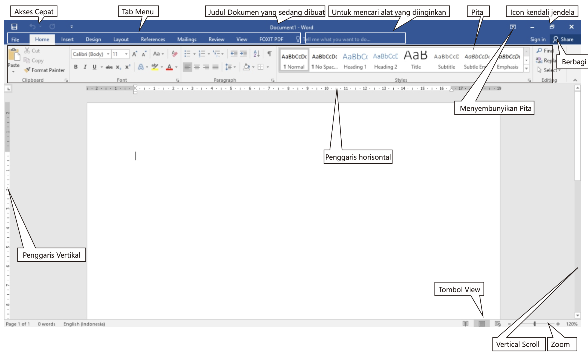
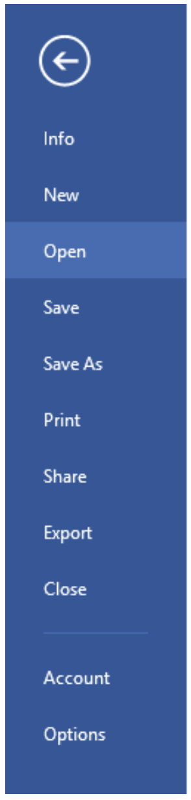

# Sekilas Tentang Microsoft Word
## Pengantar
Microsoft Word adalah program pengolah kata (word processor) yang digunakan untuk membuat berbagai jenis dokumen, seperti laporan, surat, brosur, tabel, dan banyak lagi. Microsoft Word 2016 merupakan versi yang telah dikembangkan dari versi sebelumnya, dengan banyak peningkatan dan perbaikan agar lebih relevan dan mudah digunakan di masa kini. Tidak seperti versi terdahulu seperti Word 2000, 2003, 2007, 2010, dan 2013, Word 2016 tidak lagi menggunakan menu bar tradisional dengan menu dropdown dan toolbar seperti "Formatting," "Standard," dan "Drawing." Sebagai gantinya, Word 2016 menggunakan sistem tab yang terdiri dari beberapa grup, dengan setiap grup berisi ikon atau perintah singkat untuk mempercepat akses pengguna.

## Memulai Microsoft Word
Pilih Start > Word 2016 (Jika dibuka di Windows 10), kemudian akan muncul tampilan permulaan.

  

## Tampilan Microsoft Word

  

Keterangan Gambar :
1. Quick Access, tombol untuk simpan, urung, dan mengulangi. Anda dapat tambah menu sesuai kebutuhan.
2. Tab Menu/ Menu bar, tab untuk menu-menu Microsoft Word 2016.
3. Judul dokumen, judul file/dokumen.
4. Ribbon, berisi perintah untuk tugas umum di Word. Ada banyak tab, masing-masing dengan beberapa grup perintah.
5. Minimize, untuk sembunyikan jendela/dokumen.
6. Maximize/ restore, untuk tampilkan jendela/dokumen.
7. Close, untuk tutup file/dokumen.
8. Tell me ...., Beritahu Saya untuk mencari perintah. Berguna jika Anda lupa di mana menemukan perintah.
9. Penggaris, di atas dan kiri dokumen. Membantu untuk menyelaraskan dan menyesuaikan jarak.
10. Akun Microsoft, untuk akses informasi akun, profil, dan beralih akun.
11. Status bar, memberikan informasi tentang letak cursor atau halaman saat ini, jumlah halaman, jumlah kata.
12. Area Dokumen, untuk melakukan kerja.
13. Tombol View, untuk ubah tampilan dokumen seperti Mode Baca, Tata Letak Cetak, dan Tata Letak Web.
14. Zoom, untuk tentukan ukuran tampilan dokumen di layar komputer.

## Mengaktifkan Menu-menu
a. Tampilan Backstage
Tampilan Backstage untuk menyimpan, membuka file, mencetak, dan berbagi dokumen. Untuk mengakses, klik tab File pada Pita.

    

        

            <strong>Return to Word</strong>: Gunakan panah untuk tutup tampilan Backstage dan kembali ke Word. 
            <strong>Info</strong>: Panel Info muncul saat mengakses tampilan Backstage. Berisi informasi tentang dokumen saat ini. Anda dapat memeriksa dokumen untuk menghapus informasi pribadi dan melindunginya. 
            <strong>New</strong>: Dari sini, Anda dapat membuat dokumen kosong baru atau memilih template. 
            <strong>Open</strong>: Dari sini, Anda dapat membuka dokumen yang disimpan pada komputer atau OneDrive. 
            <strong>Save dan Save As</strong>: Gunakan untuk menyimpan dokumen ke komputer atau OneDrive. 
            <strong>Print</strong>: Dari panel Print, Anda dapat mengubah pengaturan pencetakan dan mencetak buku kerja. Anda juga dapat melihat preview. 
            <strong>Share</strong>: Dari sini, Anda dapat mengundang orang untuk melihat dan berkolaborasi pada dokumen Anda. 
            <strong>Export</strong>: Dari sini, Anda dapat mengekspor dokumen Anda menjadi file dengan format lain, seperti PDF / XPS. 
            <strong>Close</strong>: Klik di sini untuk menutup buku kerja yang saat ini terbuka. 
            <strong>Account</strong>: Dari panel Account, Anda dapat mengakses informasi akun Microsoft Anda (OneDrive), mengubah tema dan latar belakang, dan keluar dari akun Anda. 
            <strong>Options</strong>: Di sini, Anda dapat mengubah berbagai pilihan Word. Misalnya, Anda dapat mengontrol pengaturan ejaan dan pemeriksaan tata bahasa, pengaturan AutoRecover, dan preferensi bahasa.
        

    

    

        
    

